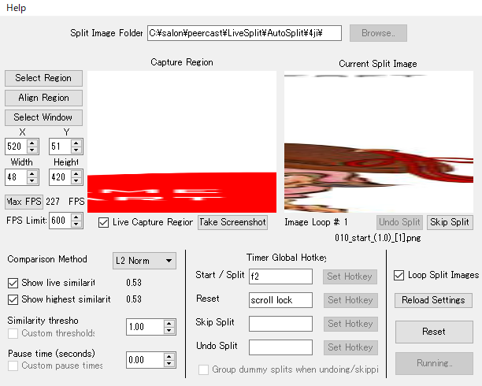
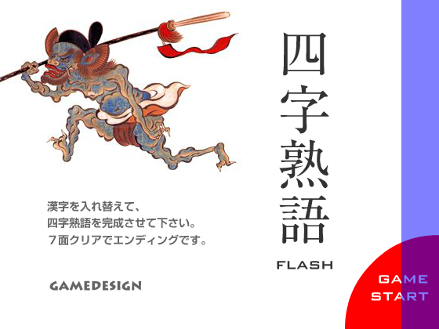
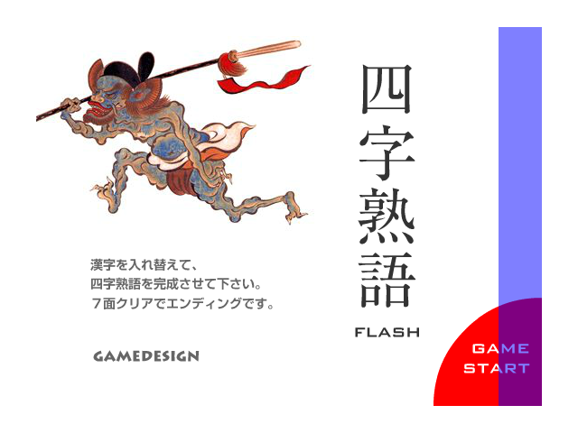

# AutoSplitの使い方

1. Flash Player Projectorにyojijuku.swfをD&Dし四字熟語Flashを起動する。
1. AutoSplitを起動し、setting.pngのように設定する。
  - Split Image Folderには圧縮ファイル内の4jiフォルダを指定する。
  - FPS Limitにはなるべく大きい値を入れるといいと思う。
  - Timer Global Hotkeyの「Start / Split」と「Reset」にはLiveSplitに設定してあるショートカットキーを指定する。
    - 注意: 「Shift+何か」のような複数のキーの組み合わせは設定できない！
  - Loop Split Imagesにチェックを入れておくと繰り返し走る場合に便利。
  - 「Select Window」ボタンを押し、Flash Player Projectorを選択する。
  - XとYには、
    - Flash Player Projectorのクライアント領域サイズがデフォルトの560x420の場合、X:520, Y:51と入力する。
    - 640x480かつ表示100%の場合(自分)、X:560, Y:81と入力する。
  - Widthには48、Heightには420を入力する。
    - region.pngで示す範囲がキャプチャできていればよい。
1. LiveSplitを起動する。AutoSplitの「Start Auto Splitter」ボタンを押して画像認識を動かし、実際に走る。
  - 完走後にまた走る場合はLiveSplitのStart/Splitキーを押すだけでよい。
  - 途中でリセットして最初から走り直したい場合、
    - Timer Global Hotkeyの「Reset」に設定してあるキーを押してLiveSplitとAutoSplitを同時にリセットしてから、「Start Auto Splitter」ボタンを押す。
    - または、LiveSplitをResetし、かつAutoSplitの「Reset」ボタンを押してから、「Start Auto Splitter」ボタンを押す。

## 設定

### 560x420

### 640x480

## その他

- 最後のSplitは、STAGE 7クリアから10.15s経過した時点で取っている。タイミングが変に感じる場合はファイル名「090_stop_(1.0)_[1]_#10150#.png」の「#10150#」の部分を変更して調整してね。
- 7面クリア直後のSplitが邪魔なら「080_Stage7_(1.0)_[0].png」を削除してね。
